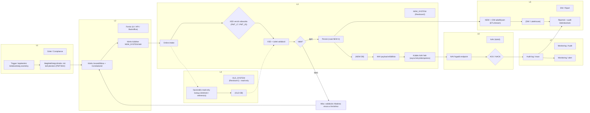
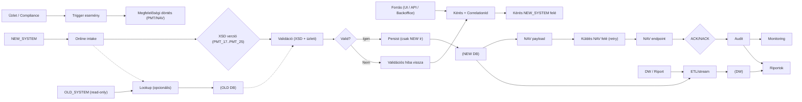

## 1) BATCH Swimlane (E2E) – (GitHub-biztos, subgraph-os)

## ✅ Javítás 1: ugyanaz subgraph-pal, de GitHub-biztos node-szintaxissal
  > Figyelj rá, hogy:
  - minden elem külön sorban legyen,
  - subgraph lezárása csak end legyen,
  - az adatbázis node: NDB[(NEW DB)] (nem idézőjeles).

## ✅ Javítás 2 (LEGbiztosabb): subgraph NÉLKÜL “swimlane-hatás” (ha a subgraph nálatok instabil)
Ha a GitHub Mermaid verziótok valamiért a subgraph-ot is érzékenyen kezeli, akkor ez a 100% kompatibilis fallback: nincs subgraph, csak “lane header” node-ok.

