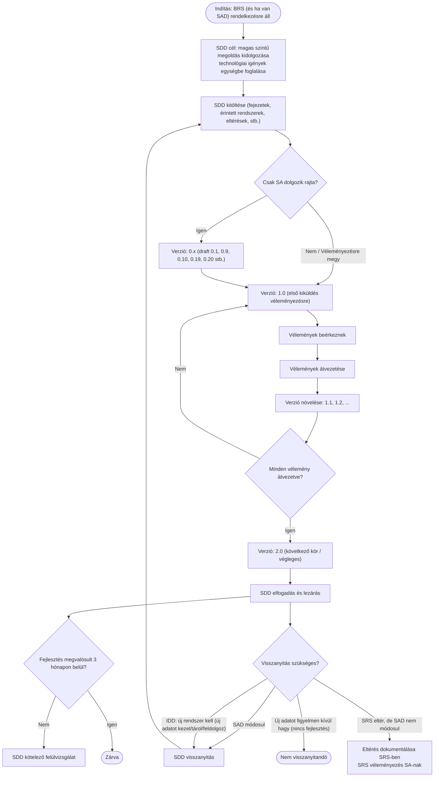

```mermaid
  flowchart TD
    A([Indítás: BRS (és ha van SAD) rendelkezésre áll]) --> B[SDD cél: magas szintű megoldás kidolgozása<br/>technológiai területek igényeinek egységbe foglalása]
    B --> C["SDD kitöltése (fejezetek, érintett rendszerek, eltérések, stb.)"]

    C --> D{Csak SA dolgozik rajta?}
    D -- Igen --> E["Verzió: 0.x (draft)"]
    D -- Nem / Véleményezésre megy --> F["Verzió: 1.0 (első kiküldés véleményezésre)"]
    E --> F

    F --> G[Vélemények beérkeznek]
    G --> H[Vélemények átvezetése]
    H --> I[Verzió növelése: 1.1, 1.2, ...]
    I --> J{Minden vélemény átvezetve?}
    J -- Nem --> F
    J -- Igen --> K["Verzió: 2.0 (következő véleményezendő<br/>vagy végleges jóváhagyandó)"]
    K --> L[SDD elfogadás és lezárás]

    L --> M{Fejlesztés megvalósult 3 hónapon belül?}
    M -- Nem --> N[SDD kötelező felülvizsgálat]
    M -- Igen --> O([Zárva])

    L --> P{Visszanyitás szükséges?}
    P -- SAD módosul --> Q[SDD visszanyitás]
    P -- IDD visszajelzés: új rendszert kell felvenni,<br/>mert új adatot kezel/tárol/feldolgoz --> Q
    P -- Csak szolgáltatást vesz igénybe,<br/>de új adatot figyelmen kívül hagy --> R([Nem visszanyitandó])
    P -- SRS közben eltérő megvalósítás,<br/>de SAD nem módosul --> S[Eltérés dokumentálása SRS-ben;<br/>SRS véleményezés SA-nak]

    Q --> C
```

## TESZT:

