## 3) Általános rendszer-szintű swimlane (E2E üzleti/rendszerfolyamat)
Kért felépítés szerint: OLD_SYSTEM (Rendszer1) és NEW_SYSTEM (Rendszer2) – egy “tipikus” modernizációs/átirányítási minta.
## 3/A) Swimlane (flowchart + subgraph lane-ek)
Ez egy “happy path + hibaág + audit” jellegű alap, amit később könnyen specializálunk (konkrét interfészek, adatmezők, batch/online, stb.).

```mermaid
flowchart LR
  %% --- SWIMLANE STYLE ---
  classDef lane fill:#f6f8fa,stroke:#c9d1d9,stroke-width:1px,color:#24292f;
  classDef decision fill:#fff3cd,stroke:#d39e00,color:#533f03;
  classDef system fill:#e8f0fe,stroke:#4c8bf5,color:#1a3d8f;
  classDef store fill:#eaffea,stroke:#2da44e,color:#0f3d1b;
  classDef error fill:#ffeef0,stroke:#cf222e,color:#82071e;

  %% --- LANES ---
  subgraph L1[Üzlet / Ügyfél]
    A1[Igény indítása / tranzakció indítása]:::lane
    A2["Üzleti validáció (szabályok, jogosultság)"]:::lane
  end

  subgraph L2["Csatorna (UI / API Client)"]
    B1[Űrlap/API kérés összeállítása]:::lane
    B2[Kérés elküldése]:::lane
    B3[Felhasználói visszajelzés megjelenítése]:::lane
  end

  subgraph L3[Integráció / API Gateway / Orchestration]
    C1[Hitelesítés / autorizáció]:::lane
    C2["Routing döntés (OLD vs NEW)"]:::decision
    C3[Transzformáció / Mapping]:::lane
    C4[Hívás NEW_SYSTEM felé]:::lane
    C5[Fallback: hívás OLD_SYSTEM felé]:::lane
    C6[Audit / Log / Trace]:::lane
  end

  subgraph L4["OLD_SYSTEM (Rendszer1)"]
    D1[Legacy üzleti logika]:::system
    D2["(Legacy adatbázis)"]:::store
  end

  subgraph L5["NEW_SYSTEM (Rendszer2)"]
    E1[Új üzleti szolgáltatás]:::system
    E2["(Új adatbázis)"]:::store
  end

  subgraph L6[Monitoring / Üzemeltetés]
    F1[Monitoring / Alerting]:::lane
    F2[Incidenskezelés / SLA]:::lane
  end

  %% --- FLOWS ---
  A1 --> A2 --> B1 --> B2 --> C1 --> C2
  C2 -- "Új funkció / migrált ügyfél / feature flag = NEW" --> C3 --> C4 --> E1 --> E2 --> C6 --> B3
  C2 -- "Nem migrált / nem támogatott = OLD" --> C5 --> D1 --> D2 --> C6 --> B3

  %% --- ERROR / EXCEPTION PATHS ---
  C4 -. "NEW hiba / timeout" .-> X1[Hiba kezelése: retry / circuit breaker]:::error
  X1 --> C5
  C6 --> F1 --> F2
```

## Mit modellez ez “általánosságban”?
  >
  - Routing döntés (pl. feature flag, migrációs állapot, ügyfél-szegmens) → NEW vagy OLD ág
  - Transzformáció / mapping az integrációs rétegben (régi ↔ új adatstruktúra)
  - Fallback NEW hibánál (opcionális, nem mindig engedélyezett)
  - Audit/Log/Trace minden tranzakciónál (banki környezetben tipikusan kötelező jellegű)
  - Monitoring / Incident csatolva a végére

##SPQR
