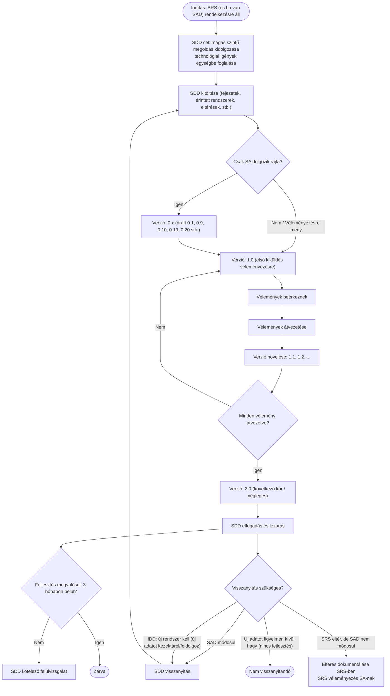

A GitHub a Mermaid-et úgy rendereli, hogy a diagram definíció **egy fenced code block-ban** van, és a nyelvazonosító **`mermaid`**.
[1](https://github.blog/developer-skills/github/include-diagrams-markdown-files-mermaid/) https://github.blog/developer-skills/github/include-diagrams-markdown-files-mermaid/

1) Mermaid “kód” megnyitása/renderelése GitHub + Confluence környezetben
GitHub (natív)
GitHub Markdownban natívan rendereli a Mermaid diagramokat, ha ```mermaid kódkockába teszed. 
A renderelés elérhető többek közt Issues, PR, Discussions, Wiki, Markdown fájlok esetén is.

#### Példa GitHub README.md-be:

Markdown```mermaidflowchart TD  A --> BTovábbi vonalak megjelenítése
> Tipp: GitHub-on a ` ```mermaid info ``` ` blokk segíthet megnézni, milyen Mermaid-verzió fut náluk.

## 1) Confluence (tipikusan macro/app)
Confluence-ben a Mermaid jellemzően **macro/app** formájában érhető el (“Mermaid diagram” jellegű macro), amibe bemásolod a Mermaid kódot és az **ott renderelődik**.
[3](https://weweave.atlassian.net/wiki/spaces/CONFMERMAID/pages/904462355/Documentation)
[4](https://marketplace.atlassian.com/apps/1222572/mermaid-charts-diagrams-for-confluence)  
Az ilyen appok gyakran tudnak **PNG/SVG exportot**, “fullscreen”, “copy code”, stb. funkciókat is.
[3](https://weweave.atlassian.net/wiki/spaces/CONFMERMAID/pages/904462355/Documentation)
[4](https://marketplace.atlassian.com/apps/1222572/mermaid-charts-diagrams-for-confluence)  
> Ha nálatok még nincs: a Marketplace-ben több Mermaid app is van (Cloud/DC/Server támogatással), pl. “Mermaid Charts & Diagrams for Confluence”.
> [4](https://marketplace.atlassian.com/apps/1222572/mermaid-charts-diagrams-for-confluence)
> [5](https://marketplace.atlassian.com/apps/3305228805/mermaid-diagrams-charts-for-confluence)  

## 2) Az **SDD életciklus** (Mermaid)
Ez a sablon logikáját követi:
→ 0.x draft
→ 1.0 véleményezés
→ 1.1/1.2… véleményátvezetés
→ 2.0 következő kör / végleges
→ lezárás, + visszanyitási szabályok és 3 hónapos felülvizsgálat.
[6](https://mfm-my.sharepoint.com/personal/u623162_mkb_hu/_layouts/15/Doc.aspx?sourcedoc=%7BF9509559-2FF3-46C0-BF92-43ED052BE335%7D&file=MBH_SolutionDesignDocument%20_sablon_20251031.docx&action=default&mobileredirect=true)



## 3) Rendszer-szintű swimlane (E2E): OLD_SYSTEM + NEW_SYSTEM, online + batch, NAV/PMT XSD routinggal, kiinduló feltételeink alapján:
  - Mindkettő van: online + batch (az SDD sablon is számol “Online/Batch” jelöléssel interfészeknél),
  - NEW_SYSTEM az író rendszer, OLD_SYSTEM read-only, de évekig kell adatfolyam/riport miatt (DW lane kötelező),
  - Routing fókusz: MBH → NAV megfelelőségi/PMT jelentés, XSD verziók (PMT_17 → PMT_25),
  #### Fontos: az alábbi “általános” és nem jogszabályi állítás – csak a mi általunk adott kontextusra épülő architektúra-váz. (Később specializálni kell konkrét hívásokra, queue-kra, idempotenciára, stb.)

<!-- 3/A) Swimlane – ONLINE E2E (valós idejű beküldés/validáció/ack) -->
## 3/A) Swimlane – ONLINE E2E (valós idejű beküldés/validáció/ack)
```
  flowchart LR
  %% ---- Styles (optional) ----
  classDef lane fill:#f6f8fa,stroke:#c9d1d9,color:#24292f;
  classDef decision fill:#fff3cd,stroke:#d39e00,color:#533f03;
  classDef system fill:#e8f0fe,stroke:#4c8bf5,color:#1a3d8f;
  classDef store fill:#eaffea,stroke:#2da44e,color:#0f3d1b;
  classDef ext fill:#f0f0ff,stroke:#6f42c1,color:#2f1c6b;
  classDef error fill:#ffeef0,stroke:#cf222e,color:#82071e;

  %% ---- Lanes ----
  subgraph L1[Üzlet / Compliance]
    A1[Trigger: bejelentési kötelezettség esemény<br/>(pl. ügylet/ügyfél/riasztás)]:::lane
    A2[Szabályok/megfelelőség döntés<br/>(PMT/NAV típus, határidő, kötelező mezők)]:::lane
  end

  subgraph L2[Csatorna / Forrás (API/UI/Backoffice)]
    B1[Kérés összeállítása + korrelációs azonosító]:::lane
    B2[Kérés küldése NEW_SYSTEM felé]:::lane
  end

  subgraph L3[NEW_SYSTEM (Rendszer2)]
    C1[Online intake API]:::system
    C2{XSD verzió kiválasztás<br/>(PMT_17..PMT_25)}:::decision
    C3[XSD validáció + üzleti validáció]:::lane
    C4{Valid?}:::decision
    C5[Perzisztálás (csak NEW write)]:::system
    C6[(NEW DB)]:::store
    C7[Üzenet/payload előállítás NAV felé]:::lane
    C8[Aszinkron küldés / retry / idempotencia]:::lane
  end

  subgraph L4[OLD_SYSTEM (Rendszer1) - Read-only]
    D1[Read-only lookup (opcionális)<br/>történeti adatok / referencia]:::system
    D2[(OLD DB)]:::store
  end

  subgraph L5[DW / Riport]
    E1[Streaming/CDC/ETL: NEW -> DW]:::lane
    E2[(DW / Lakehouse)]:::store
    E3[Riportok / Audit lekérdezések]:::lane
  end

  subgraph L6[NAV (külső)]
    F1[NAV fogadó endpoint]:::ext
    F2[Visszaigazolás / hiba (ACK/NACK)]:::ext
  end

  subgraph L7[Monitoring/Audit]
    G1[Audit log / trace / naplózás]:::lane
    G2[Monitoring / alerting]:::lane
  end

  %% ---- Flow ----
  A1 --> A2 --> B1 --> B2 --> C1 --> C2 --> C3 --> C4
  C4 -- "Igen" --> C5 --> C6 --> C7 --> C8 --> F1 --> F2 --> G1 --> G2
  C4 -- "Nem" --> X1[Hiba: validációs hiba lista<br/>vissza a forráshoz / javítás]:::error --> B1

  %% ---- Optional OLD lookup ----
  C1 -. "opcionális lookup" .-> D1 --> D2 -. "referencia adatok" .-> C3

  %% ---- DW feed ----
  C5 --> E1 --> E2 --> E3
  G1 --> E3
```
## 3/B) Swimlane – BATCH E2E (időzített összeállítás + validáció + tömeges küldés)
```
flowchart LR
  classDef lane fill:#f6f8fa,stroke:#c9d1d9,color:#24292f;
  classDef decision fill:#fff3cd,stroke:#d39e00,color:#533f03;
  classDef system fill:#e8f0fe,stroke:#4c8bf5,color:#1a3d8f;
  classDef store fill:#eaffea,stroke:#2da44e,color:#0f3d1b;
  classDef ext fill:#f0f0ff,stroke:#6f42c1,color:#2f1c6b;
  classDef error fill:#ffeef0,stroke:#cf222e,color:#82071e;

  subgraph L1[Üzlet / Compliance]
    A1["Batch szabályok: cut-off, scope, szűrés<br/>(mit kell jelenteni)"]:::lane
  end

  subgraph L2[Batch Scheduler / Orchestrator]
    B1["Ütemezés (napi/órás)<br/>batch run indítása"]:::lane
    B2[Batch run ID + kontroll táblák]:::lane
  end

  subgraph L3["NEW_SYSTEM (Rendszer2)"]
    C1["Adatkivonat (NEW DB/DWH staging)"]:::system
    C2["(NEW DB)"]:::store
    C3{XSD verzió kiválasztás<br/>(PMT_17..PMT_25)}:::decision
    C4["XML fájlok összeállítása<br/>(szekvencia, csomagolás)"]:::lane
    C5["XSD validáció + üzleti kontrollok<br/>(rekord-szám, összegek, duplikáció)"]:::lane
    C6{Valid?}:::decision
    C7[Batch küldés NAV felé<br/>retry + partial resend]:::lane
    C8[Batch státusz frissítése]:::lane
  end

  subgraph L4["OLD_SYSTEM (Rendszer1) - Read-only"]
    D1["Read-only történeti összevetés (opcionális)"]:::system
    D2["(OLD DB)"]:::store
  end

  subgraph L5[DW / Riport]
    E1[DW staging + historizálás]:::lane
    E2["(DW / Lakehouse)"]:::store
    E3[Riport: beküldés/hibák/lefutások]:::lane
  end

  subgraph L6["NAV (külső)"]
    F1[NAV batch fogadó endpoint]:::ext
    F2[ACK/NACK + hibajegyzék]:::ext
  end

  subgraph L7[Monitoring/Audit]
    G1["Batch audit log (runID, counts, hashes)"]:::lane
    G2[Monitoring / alert]:::lane
  end

  A1 --> B1 --> B2 --> C1
  C1 --> C2 --> C3 --> C4 --> C5 --> C6
  C6 -- "Igen" --> C7 --> F1 --> F2 --> C8 --> G1 --> G2
  C6 -- "Nem" --> X1["Batch hiba: hibajegyzék + visszajavítási kör<br/>(rekord szint / file szint)"]:::error --> C8

  %% optional OLD compare
  C5 -. "opcionális összevetés" .-> D1 --> D2 -. "kontroll" .-> C5

  %% DW reporting
  C8 --> E1 --> E2 --> E3
  G1 --> E3
```
## 3/C) Közös architektúra-szabályok (a te pontjaid alapján “beégetve”)
  - NEW_SYSTEM a single writer (minden perzisztálás ide megy), OLD csak read-only.
  - DW/Riport lane kötelező: NEW→DW adatfolyam, és a NAV beküldések/ACK/NACK/audit riportja is innen legyen “visszamérhető”.
  - Online + Batch párhuzamosan: a sablon is számol ezzel interfész szinten (“Online/Batch” mező).

### Csak pontosítás, hogy specializálni tudjuk! - Nem kell most megválaszolni, csak kérdezem:
  - NAV felé kommunikáció: szinkron API (azonnali ACK) vagy aszinkron (későbbi státusz)?
  - Üzenetközvetítő: van-e standard (ESB/Kafka/ServiceBus) – kell-e DLQ?
  - Idempotencia kulcs: mi legyen a deduplikáció alapja (ügyletID + típus + dátum + XSD verzió)?
  - XSD verzióváltás kezelése: párhuzamosan több verzió (PMT_17..PMT_25), vagy “cutover” dátum szerint?

<!--
https://docs.github.com/en/get-started/writing-on-github/working-with-advanced-formatting/creating-diagrams
your comment goes here
and here
-->
https://docs.github.com/en/get-started/writing-on-github/working-with-advanced-formatting/creating-diagrams
